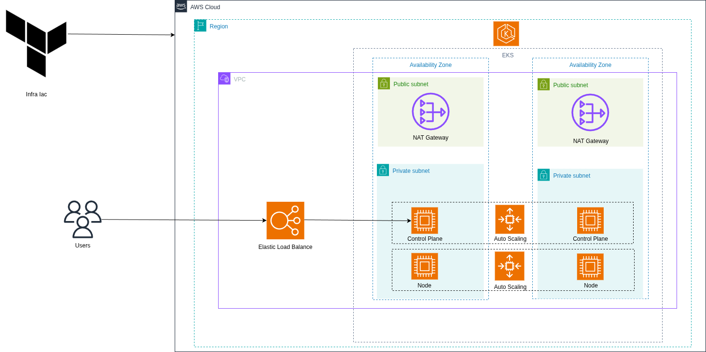

# Projeto Arquitetural EKS - Alta Disponibilidade com AWS

Este repositório apresenta uma arquitetura de referência para um ambiente de **alta disponibilidade** utilizando o **Amazon EKS (Elastic Kubernetes Service)**, projetado com foco em **resiliência, escalabilidade** e **segurança em nuvem**.

## 🌐 Visão Geral da Arquitetura

A imagem abaixo descreve visualmente o cenário arquitetural, representando os principais componentes distribuídos em múltiplas zonas de disponibilidade (AZs):

### 📌 Componentes Principais

- **Zonas de Disponibilidade (AZs)**: Infraestrutura distribuída para garantir tolerância a falhas.
- **Subnets Públicas e Privadas**:
  - Subnets públicas abrigam componentes como ALBs e NAT Gateways.
  - Subnets privadas abrigam os nós do cluster EKS e os serviços sensíveis.
- **Cluster EKS**:
  - Gerenciado pela AWS, com auto scaling e alta disponibilidade entre zonas.
  - Worker nodes (EC2) ou Fargate opcional.
- **Load Balancer (ALB)**:
  - Distribui o tráfego externo para os serviços hospedados no cluster.
- **Rota de Internet e NAT Gateway**:
  - Permite comunicação segura entre os nós privados e a internet.

### 🔐 Segurança

- **Security Groups** e **Network ACLs** são utilizados para controlar o tráfego entre subnets e serviços.
- IAM Roles e Service Accounts são configurados com permissões mínimas necessárias (princípio de menor privilégio).

---

## ⚙️ Tecnologias Utilizadas

- **Amazon EKS**
- **VPC com múltiplas AZs**
- **Amazon EC2 / Fargate**
- **AWS Load Balancer Controller**
- **IAM Roles for Service Accounts (IRSA)**
- **Helm / Terraform / kubectl**

---

## 🚀 Objetivo

Fornecer uma base sólida para implementação de aplicações resilientes e seguras em Kubernetes utilizando EKS, com foco em boas práticas de arquitetura em nuvem.

---

## 📄 Licença

Este projeto está licenciado sob a [MIT License](LICENSE).

---

## ✍️ Contribuições

Contribuições são bem-vindas! Sinta-se à vontade para abrir *issues*, *pull requests* ou compartilhar sugestões de melhoria.
